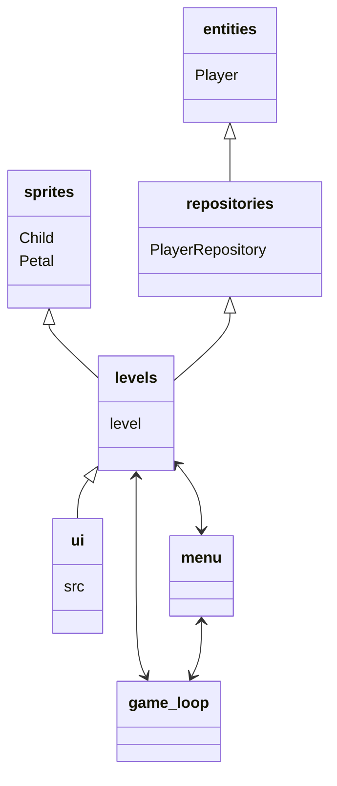

##ARCHITECTURE

#structure:

"Game follows the following architecture:"

"class diagram:"

The game has sprites for the playable, movable creatures, 1 user that can be named (not done) that plays as one of the sprites but moves multiple, a UI side with multiple different screen displays. 

