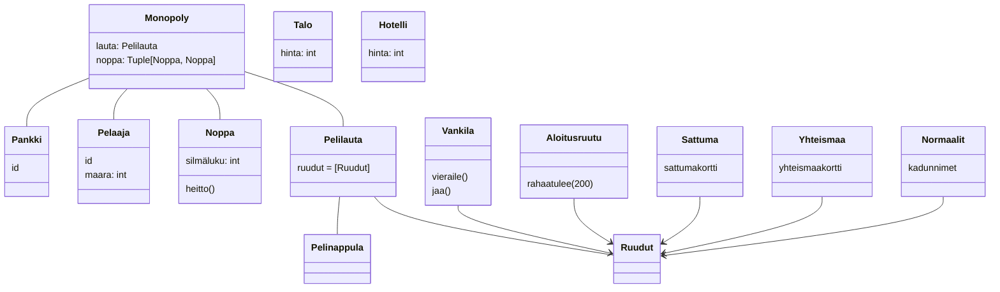

## Sovelluslogiikka

Monopolia pelataan käyttäen kahta noppaa. Pelaajia on vähintään 2 ja enintään 8. Peliä pelataan pelilaudalla joita on yksi. Pelilauta sisältää 40 ruutua. Kukin ruutu tietää, mikä on sitä seuraava ruutu pelilaudalla. Kullakin pelaajalla on yksi pelinappula. Pelinappula sijaitsee aina yhdessä ruudussa.

